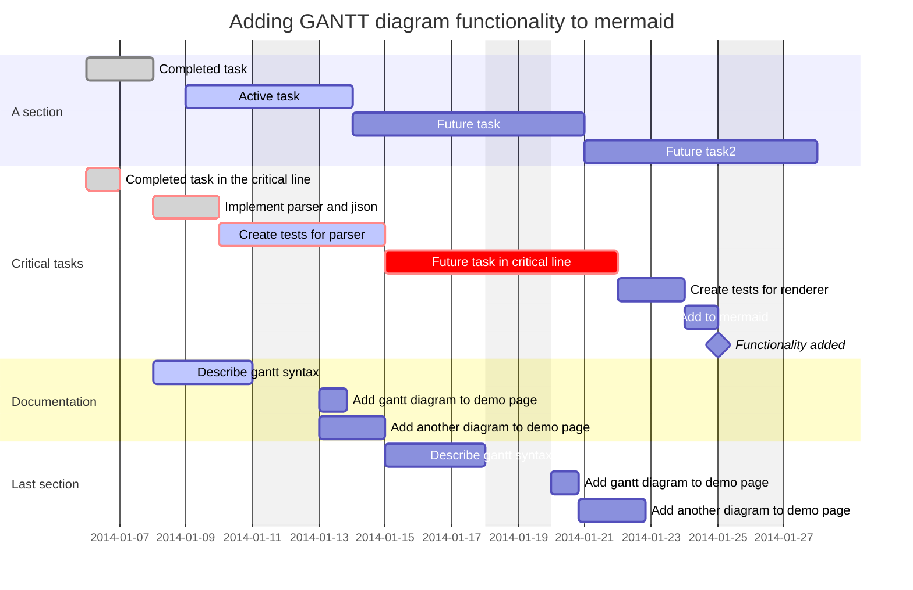

# Research Data Manager Program
## Setup
A research article PDF electronic filing system is antiquated and difficult to use.
## Problem
Users waste precious time hunting documents spread across small overlapping categorical folders to track down each PDF manually, then must visually scan the document to determine by ad hoc metrics if those contents match their needs.
## Options
### File Organization
- Decentralized file subfolder organization system [current]
- Centralize research documents within a single folder
### File Search and Sort
- Manual [current]
- Implement algorithm using keyword lists
- Implement algorithm using key:vale metadata
### File Data Organization
- Encode minimal article data in PDF file names [current]
- Encode article data as object literals
- Encode article data as JSON 
### File Data Updates
- None [current]
- Manually update data
- Implement webscraper to update data
## Solution
Centralize research documents within a single folder. Design network of article, author, organization, and grant metadata to be accessed by HTML card catalog. Create a JavaScript algorithm to accept catalog search input, filter documents based on metadata 	keywords, sort results by match strength, then output a PDF hyperlinks ranked list.
## Goals
- Lessen the personnel-hour burden of research pdf information retrieval
- Strike an acceptable compromise between backend system automation and frontend user input flexibility
- Make the system easy to use and hard to break
## Features
### Critical Implemented
### Critical Unimplemented
- ddddd
### Wishlist Unimplemented
- ddddd
## Development
### Process
- flowchart
### Architecture
- class chart
### Schedule

### Responsibilities
- keyed list

## Reference Code
- [Template Literals](https://www.youtube.com/watch?v=DG4obitDvUA&t=2069s)
