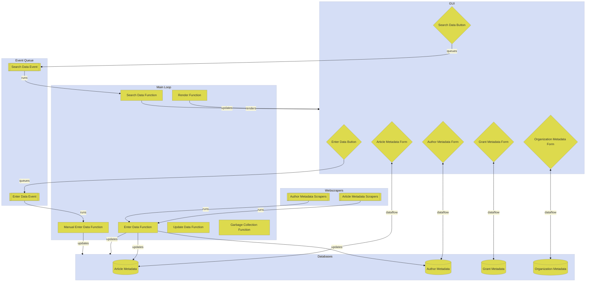

# Research Data Manager Program
## Setup
A research article PDF electronic filing system is antiquated and difficult to use.
## Problem
Users waste precious time hunting documents spread across small overlapping categorical folders to track down each PDF manually, then must visually scan the document to determine by ad hoc metrics if those contents match their needs.
## Goals
- Automate repetitive tasks
- Compromise between automation rigidity and input flexibility
- Make system easy to use and hard to break
- Optimize time management
- Organize and properly archive data
## Options
### File Organization
- Decentralized file subfolder organization system [current]
- Centralize research documents within a single folder
### File Search and Sort
- Manual [current]
- Implement algorithm using keyword lists
- Implement algorithm using key:value metadata
### File Data Organization
- Encode minimal article data in PDF file names [current]
- Encode article data as object literals
- Encode article data as JSON 
### File Data Updates
- None [current]
- Manually update data
- Implement webscraper to update data
## Solution
Centralize research documents within a single folder. Design network of article, author, organization, and grant metadata to be accessed by HTML card catalog. Create a JavaScript algorithm to accept catalog search input, filter documents based on metadata 	keywords, sort results by match strength, then output a PDF hyperlinks ranked list.
## User Process
- flowchart
## System Architecture


## Development Schedule
```mermaid
%%{init: {'theme': 'base', 'themeVariables': 
{ 'primaryColor': '#DDDA4D', 'edgeLabelBackground':'#F7F6DA', 'tertiaryColor': '#D5DEF6'}}}%%
gantt
    dateFormat  YYYY-MM-DD
    title       Newsletter Concatenation Program Schedule
    excludes    weekends
    
    todayMarker stroke-width:5px,stroke:#0f0,opacity:0.5
    
    section Plan
    Define problem scope      :done,  scope, 2021-10-06,5d
    Define target user        :done,  user, 2021-10-08, 5d
    Draft readme              :done,  readmedraft, after user, 6d
    Iterate readme            :done,  readmeiterate, 2021-11-16, 5d
    Draft designdoc           :done,  designdocdraft, after readmedraft, 5d
    Draft architecture        :done,  archituredraft, 2021-12-02, 3d
    Code architecture         :done,  architurecode, 2022-03-09, 3d
    Draft gantt chart         :done,  ganttdraft, 2021-11-25, 4d
    Code gantt chart          :done,  ganttcode, 2022-03-10, 3d
    
    section Prototype
    Create sample databases    :done, databasecreate, 2021-11-05, 15d
    Create filter algorithm    :done, algofiltercreate, 2022-01-10, 3d
    Iterate filter algorithm   :done, algofilteriterate, algofiltercreate, 4d
    Create main program        :done, maincreate, 2022-03-10, 3d
    
    section Prune
    Softcode filter algorithm   :active, algofiltersoftcode, 2022-03-15, 3d
    
    section Playtest
    
    section Polish
    
    section Post
```
## Responsibilities
- keyed list (uml seq diagram)
## Features
### Critical Implemented
### Critical Unimplemented
- ddddd
### Wishlist Unimplemented
- ddddd
## Reference Code
- [Template Literals](https://www.youtube.com/watch?v=DG4obitDvUA&t=2069s)
